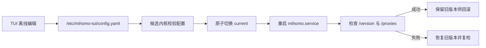

<div align="center">

# mihomo-tui

**面向 Linux 服务器、适合通过 SSH 使用的 Mihomo 终端控制中心**

在一个原生配置文件中管理订阅、代理、规则、TUN 与 DNS，并以可审计、可回滚的方式管理 Mihomo 内核。

[](https://github.com/bilbilmyc/mihomo-tui/actions/workflows/ci.yml)
[](https://www.rust-lang.org/)
[](#系统要求)
[](#许可证)

[快速开始](#快速开始) · [安装](#安装) · [使用说明](#使用说明) · [项目文档](#项目文档) · [参与贡献](#参与贡献)

</div>

> [!IMPORTANT]
> 本仓库目前尚未声明 `mihomo-tui` Rust 源码的项目级许可证。公开可见不等于获得复制、修改或分发授权；打包发布仍需维护者先明确许可证与版权信息。随包提供的 Mihomo GPL-3.0 材料只适用于 Mihomo 本身。

## 项目简介

`mihomo-tui` 管理唯一一份原生 Mihomo YAML：`/etc/mihomo-tui/config.yaml`。即使 Mihomo 尚未安装、已经停止或暂时无法连接，仍可离线编辑订阅、规则、TUN 和 DNS；应用配置时，受管的 Mihomo 服务会直接读取同一个文件，不生成第二份运行时副本。

Deb 与 RPM 是完整的软件包，包含 `mihomo-tui`、经过固定和校验的官方 Mihomo 二进制、systemd unit、许可证/源码声明以及带版本的托管内核目录。Mihomo 始终作为独立进程运行，不会链接进 Rust 程序。项目同时提供仅包含 TUI 的原生 ELF，用于连接已有 Controller。

## 核心特性

- 基于 Ratatui 的状态、代理、规则和配置四个工作区
- 通过一个原生 YAML 管理订阅、规则、TUN、DNS、端口和运行模式
- 首次启动可无损导入现有 Mihomo 配置，并保留未知或自定义字段
- 配置原子写入、权限为 `0600` 的私有备份及写入前语法检查
- 通过 Controller API 获取代理组、切换节点、刷新数据和测试延迟
- 显式应用配置，不在启动或普通编辑过程中隐式安装、升级或重载内核
- 带版本的不可变内核目录、原子激活、API 健康检查和失败自动回滚
- 原生 `x86_64` / `aarch64` Deb、RPM 与 ELF 发布物及 SHA-256 校验文件
- 适配普通 SSH 终端，不依赖 Nerd Fonts

## 快速开始

在受支持的 Debian/Ubuntu 服务器上安装 Deb：

```bash
sha256sum --check mihomo-tui_*.deb.sha256
sudo apt install ./mihomo-tui_*.deb
mihomo-tui core status
sudo mihomo-tui
```

首次进入 TUI 后完成配置，按 `p` 校验配置并启动或重载 Mihomo。软件包安装本身不会启用或启动 `mihomo.service`；确认首次应用成功后，如需开机启动，再执行：

```bash
sudo systemctl enable mihomo.service
```

服务器安装、升级、日志与恢复操作请直接阅读[《Linux 服务器使用手册》](docs/server-guide.md)。Deb 和 RPM 也会把该手册安装到 `/usr/share/doc/mihomo-tui/server-guide.md`。

## 安装

### Deb：Debian / Ubuntu

```bash
sha256sum --check mihomo-tui_*.deb.sha256
sudo apt install ./mihomo-tui_*.deb
```

### RPM：Fedora / RHEL 系发行版

```bash
sha256sum --check mihomo-tui-*.rpm.sha256
sudo dnf install ./mihomo-tui-*.rpm
```

Deb 与 RPM 都包含受管 Mihomo 内核和 systemd unit。全新安装会拒绝覆盖已有的 Mihomo 二进制、服务或托管目录；遇到冲突时，应先确认现有安装的来源，或改用外部 Controller 模式。

### 原生 ELF：连接已有 Controller

原生 ELF 只包含 TUI，不包含 Mihomo 和 systemd unit：

```bash
sha256sum --check mihomo-tui-*-linux-$(uname -m).sha256
sudo install -m 755 mihomo-tui-*-linux-$(uname -m) /usr/local/bin/mihomo-tui
MIHOMO_SECRET='你的密钥' mihomo-tui --controller http://127.0.0.1:9093
```

### 从源码构建

```bash
git clone https://github.com/bilbilmyc/mihomo-tui.git
cd mihomo-tui
cargo build --release --locked
sudo ./target/release/mihomo-tui
```

默认本机托管路径需要 root 权限。开发或隔离测试时可显式指定工作区，并关闭自动安装：

```bash
cargo run -- \
  --workspace "$HOME/.config/mihomo-tui/config.yaml" \
  --config "$HOME/.config/mihomo/config.yaml" \
  --no-auto-install
```

## 系统要求

| 项目 | 支持范围 |
| --- | --- |
| 操作系统 | 使用 systemd 的 Linux；本机自动安装当前限 Debian/Ubuntu |
| 架构 | `x86_64`、`aarch64` |
| 终端 | 支持标准 ANSI 控制序列的 SSH 或本地终端 |
| 权限 | 外部 Controller 模式通常无需 root；本机安装、应用和升级需要 root |
| Mihomo | Deb/RPM 自带受测内核；外部模式可连接用户自行管理的 Controller |

## 使用说明

### 本机托管模式

不传路径或 Controller 参数时，程序管理 `/etc/mihomo-tui/config.yaml`、本机 `mihomo.service` 和托管内核：

```bash
sudo mihomo-tui
```

启动只打开并编辑配置，不会自动升级内核。按 `p` 才会校验配置、配置受管 systemd drop-in，并执行 `reload-or-restart`。

### 外部 Controller 模式

连接由其他工具管理的 Mihomo，不修改本机 systemd：

```bash
MIHOMO_SECRET='你的密钥' \
  mihomo-tui --controller http://127.0.0.1:9093
```

密钥优先通过 `MIHOMO_SECRET` 传入，避免出现在 shell 历史和进程列表中。远程 Controller 不应通过公网明文 HTTP 暴露。

### 常用命令

| 命令 | 说明 |
| --- | --- |
| `mihomo-tui` | 启动终端界面 |
| `mihomo-tui -h` | 查看完整中文帮助 |
| `mihomo-tui core status` | 只读查看当前、已安装、推荐和兼容版本 |
| `sudo mihomo-tui core upgrade` | 显式执行带健康检查和自动回滚的内核升级 |
| `mihomo-tui --controller <地址>` | 连接已有 Controller |
| `mihomo-tui --no-auto-install` | 应用配置时禁止安装缺失的 Mihomo |

### 快捷键

| 按键 | 操作 |
| --- | --- |
| `1` / `2` / `3` / `4`、`Tab` | 切换状态、代理、规则和配置页面 |
| `j` / `k`、方向键 | 移动选择 |
| `Right` / `Enter`、`Left` | 进入或退出代理组节点列表 |
| `Enter` | 应用选中的代理节点 |
| `l` | 测试选中节点的延迟 |
| `r` | 刷新 Mihomo 数据；配置页优先更新选中的 HTTP 订阅 |
| `p` | 校验当前配置并启动或重载受管 Mihomo |
| `t` / `d` | 从状态页打开 TUN / DNS 高级设置 |
| `a` / `A` | 添加订阅，或在规则列表顶部 / 底部添加规则 |
| `e` | 编辑选中的订阅或规则 |
| `Space` / `x`、`s` | 标记规则删除、保存规则变更 |
| `J` / `K` | 下移 / 上移规则 |
| `q` / `Esc` | 退出 |

## 配置模型

默认配置文件可直接由 Mihomo 使用：

```yaml
mixed-port: 7890
external-controller: 127.0.0.1:9093
rules:
  - MATCH,DIRECT
```

首次启动按以下顺序初始化：

1. 如果 `/etc/mihomo-tui/config.yaml` 已存在，直接读取。
2. 否则，如果显式指定了旧配置，完整导入该文件。
3. 否则，如果 `/etc/mihomo/config.yaml` 存在，完整导入且不改动原文件。
4. 都不存在时，创建最小原生配置。

一旦受管配置存在，后续启动不会再次导入旧文件。完整存储、迁移与应用约定见[《单一配置约定》](docs/independent-config.md)。

## 托管内核

`managed-core.json` 是推荐版本、兼容范围、架构包名、包元数据、许可证哈希和 SHA-256 的唯一来源。普通启动和按 `p` 应用配置都不会执行内核升级。

```bash
mihomo-tui core status
sudo mihomo-tui core upgrade
```

升级会复用已安装的候选版本，或下载并校验固定的官方 Deb；候选通过版本和配置校验后，程序原子切换 `current`，重启服务并检查 `/version` 与 `/proxies`。任一环节失败都会切回旧版本并再次检查健康状态。

详细安全边界和发布流程见[《Mihomo 托管内核》](docs/managed-core.md)与 [ADR-0001](docs/decisions/0001-bundle-mihomo-as-a-separate-process.md)。



## 项目结构

```text
src/app.rs             TUI 状态与页面流程
src/config.rs          原生 Mihomo YAML 读取和编辑
src/mihomo.rs          Controller API 边界
src/core/              版本、清单和兼容策略
src/core_manager/      托管内核清单与不可变存储
src/core_upgrade/      激活、健康检查和回滚事务
src/runtime/           安装与 systemd 生命周期
managed-core.json      可审查的官方内核发布约定
packaging/             Deb、RPM 与 systemd 模板
scripts/               构建、发布和包验证脚本
docs/                  运维、设计与发布文档
```

## 项目文档

| 文档 | 内容 |
| --- | --- |
| [Linux 服务器使用手册](docs/server-guide.md) | 安装、首次使用、升级、日志、故障排查和恢复 |
| [单一配置约定](docs/independent-config.md) | 配置所有权、首次迁移、离线编辑和应用语义 |
| [Mihomo 托管内核](docs/managed-core.md) | 架构、安全边界、升级事务和上游同步 |
| [Debian 软件包运维](docs/debian-package.md) | Deb 构建、安装布局、升级与卸载 |
| [Linux 发布物](docs/release-artifacts.md) | Deb、RPM、ELF 产物约定与 CI 发布门禁 |
| [ADR-0001](docs/decisions/0001-bundle-mihomo-as-a-separate-process.md) | 将 Mihomo 作为独立进程随包分发的决策记录 |

## 开发与验证

```bash
cargo fmt --check
cargo test --all-targets
cargo clippy --all-targets -- -D warnings
cargo build --release --locked
```

在原生目标架构上构建并检查全部 Linux 发布格式：

```bash
rust_arch=$(uname -m)
deb_arch=$(dpkg --print-architecture)
./scripts/build-native.sh --architecture "$rust_arch" --binary target/release/mihomo-tui
./scripts/build-deb.sh --architecture "$deb_arch" --binary target/release/mihomo-tui
./scripts/build-rpm.sh --architecture "$rust_arch" --binary target/release/mihomo-tui
./scripts/test-native-binary.sh dist/mihomo-tui-*-linux-"$rust_arch"
./scripts/test-deb-package.sh dist/*.deb
./scripts/test-rpm-package.sh dist/*.rpm
```

完整产物和 CI 约定见[《Linux 发布物》](docs/release-artifacts.md)。

## 安全说明

- 不要在公开问题中粘贴完整配置、API 密钥或订阅地址。
- 不要把 `secret` 直接写入命令行；优先使用 `MIHOMO_SECRET`。
- 默认让 Controller 监听 `127.0.0.1`，远程使用时优先选择 HTTPS、专用网络或 SSH 转发。
- 修改远程服务器的 TUN、路由或 DNS 前，保留第二个 SSH 会话和可用的恢复路径。
- 下载的 Mihomo 包必须通过大小限制、重定向限制、SHA-256、Deb 元数据和精确版本校验后才会执行。

安全问题请不要附带真实凭据或公开可用的节点信息；在项目提供私密报告渠道之前，先提交不含敏感数据的最小问题描述。

## 参与贡献

欢迎通过 Issue 报告可复现问题，或提交范围清晰的 Pull Request。提交前请：

1. 说明问题、预期行为和影响范围。
2. 为行为变更添加测试，并保留未知 Mihomo 配置字段。
3. 运行格式化、测试、Clippy 和 release 构建。
4. 不在提交、日志、测试夹具或截图中包含真实凭据。
5. 涉及兼容范围、包布局或自动升级策略时，补充设计依据和回滚证据。

## 许可证

`mihomo-tui` Rust 源码目前**尚未声明项目级许可证**。在维护者补充明确的许可证和版权持有人之前，本仓库默认保留全部权利，公开可见不构成开源授权，也不应发布项目二进制包。

随 Deb/RPM 分发的 Mihomo 是独立项目；其固定许可证文本、源码地址和哈希由 `managed-core.json` 及打包流程单独管理，不会替 `mihomo-tui` 选择许可证。
